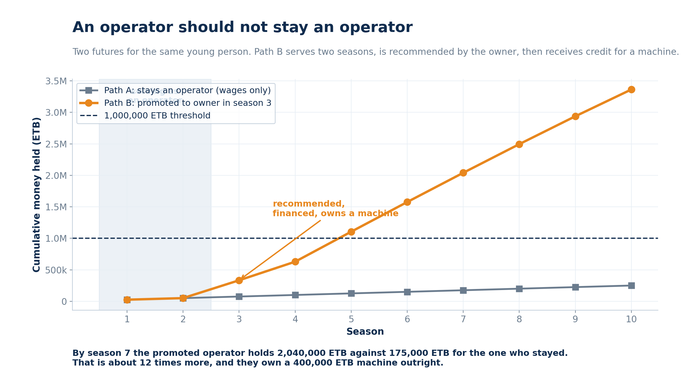
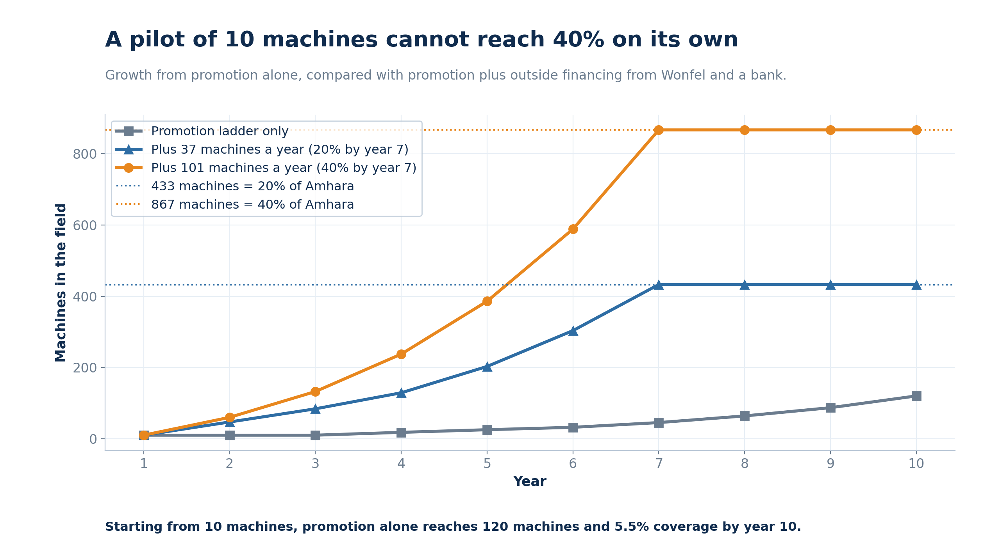
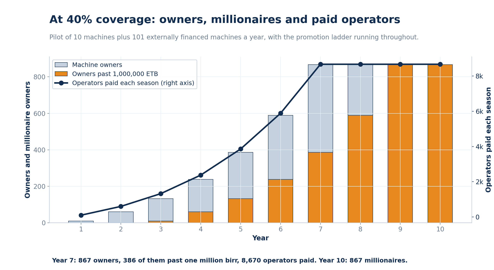
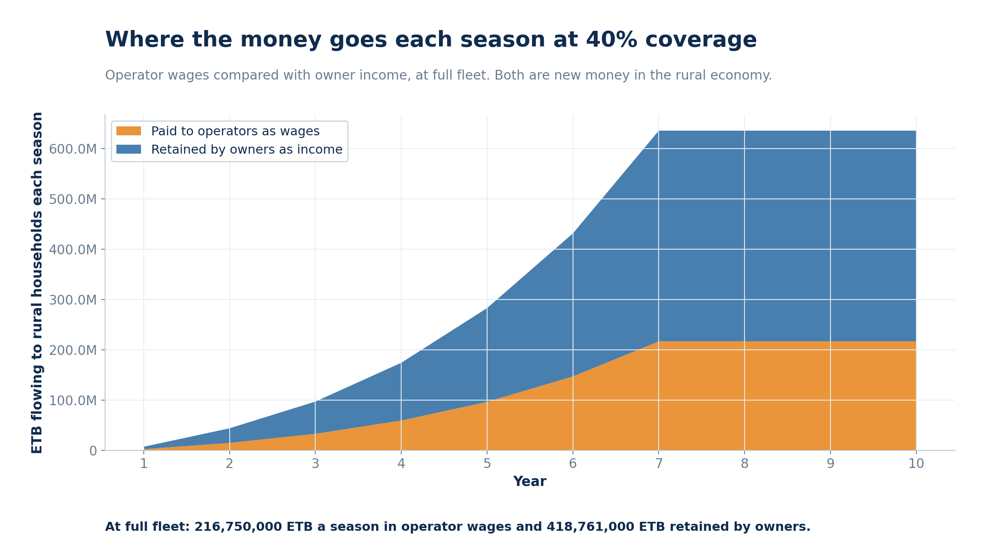

# MMS-I Growth and Impact Model

A reproducible model of the Mezewir MMS-I maize sheller programme in the Amhara
region of Ethiopia. It projects how many machine owners reach one million birr,
how many operators are paid, how many farming households are served, and how the
fleet grows when good operators are promoted into ownership.

Every number this repository produces can be traced to a stated assumption in
`Params`. Change an assumption, rerun, and the whole projection moves with it.

---

## The idea being modelled

A young entrepreneur is financed to acquire a maize sheller. They run it as a
service business through the harvest season, hire ten operators, serve several
hundred farming households, and repay the machine cost.

The part that makes the programme compound is the **promotion ladder**. An
operator is not meant to remain an operator. After a minimum period of service,
on the recommendation of the machine owner, an operator becomes eligible for
credit and can acquire a machine of their own. Their savings from wages become
the down payment. Those new owners hire ten operators each, and the cycle
repeats.

```
        financed owner
              |
      hires 10 operators
              |
   operator serves 2 seasons, saves wages
              |
   owner recommends  ->  credit approved
              |
      operator becomes owner
              |
      hires 10 operators  ->  repeat
```

---

## Install and run

```bash
pip install -r requirements.txt
cd src

# interactive demo, every assumption on a slider
streamlit run app.py

# or run the model from the command line
python mms_growth_model.py --seed 10 --coverage 0.40 --years 10
python make_charts.py
```

Command line options:

| Flag | Meaning | Default |
|---|---|---|
| `--seed` | machines financed in the pilot | 10 |
| `--coverage` | target share of the regional harvest, e.g. `0.40` | none |
| `--years` | projection horizon | 10 |
| `--promotion-rate` | share of eligible operators promoted per year | 0.08 |
| `--out` | write the yearly table to a CSV | none |

---

## Headline results

Seed pilot of 10 machines. Amhara reference volume of 26 million quintals.

| Scenario | Externally financed per year | Machines yr 7 | Millionaire owners yr 7 | Millionaire owners yr 10 | Operators paid yr 10 | Coverage yr 10 |
|---|---|---|---|---|---|---|
| Promotion ladder only | 0 | 45 | 25 | 64 | 1,202 | 5.5% |
| Reach 20% by year 7 | 37 | 433 | 203 | 433 | 4,330 | 20.0% |
| Reach 40% by year 7 | 101 | 867 | 386 | 867 | 8,670 | 40.0% |
| Reach 40% by year 10 | 25 | 309 | 145 | 441 | 8,670 | 40.0% |

The first row is the most important finding. **A pilot alone does not scale.**
Promotion compounds, but from a base of ten machines it reaches only about 120
machines and 5.5 percent coverage in ten years. Reaching 40 percent by year 7
needs roughly 101 externally financed machines a year on top of the promotion
ladder. Stretching the same target to year 10 cuts that to about 25 a year.

### The promotion ladder, per person

| Season | Path A: stays an operator | Path B: promoted in season 3 |
|---|---|---|
| 2 | 50,000 ETB | 50,000 ETB |
| 3 | 75,000 ETB | 333,000 ETB |
| 5 | 125,000 ETB | 1,104,620 ETB |
| 7 | 175,000 ETB | 2,040,365 ETB |
| 10 | 250,000 ETB | 3,363,688 ETB |

Path B passes one million birr in season 5 and ends season 10 with about
thirteen times the money of Path A, plus a machine owned outright.

---


## Figures

**The promotion ladder.** Two futures for the same young person.



**Growth paths.** A pilot alone does not reach 40 percent coverage.



**Outcomes at 40 percent coverage.** Owners, millionaire owners and paid operators.



**Where the money goes.** Operator wages against owner income, each season.



---

## Co-financing

A machine is paid for from three sources, and the owner repays two of them out
of the harvest.

| Source | Share | Amount | Terms |
|---|---|---|---|
| Youth equity | 5% | 20,000 ETB | savings from seasons worked as an operator, no repayment |
| Partner fund | 45% | 180,000 ETB | interest free, repaid over 2 seasons |
| Lease facility | 50% | 200,000 ETB | 14.5% over 3 seasons |

> The lease rate and tenor are **illustrative placeholders**, not quoted terms.
> Replace them in `financing.py` or on the sidebar once a lessor quotes.

At these placeholder terms the lease costs 86,870 ETB a season, total interest
is 60,610 ETB, and the cost of capital is about 15 percent of the machine price.

What that does to the owner:

| Season | Face value repayment | With co-financing |
|---|---|---|
| 1 | 283,000 ETB | 306,130 ETB |
| 2 | 563,200 ETB | 609,460 ETB |
| 3 | 1,039,620 ETB | 999,010 ETB |
| 7 | 2,873,065 ETB | 2,832,455 ETB |

The financed owner is **ahead** for two seasons, because spreading the lease
over three seasons costs less per season than repaying 200,000 ETB a year. From
season three onward they are 40,610 ETB behind, which is the interest less the
smaller principal they financed. The one million birr milestone moves from
season 3 to season 4, and only just: at season 3 they are 990 ETB short.

---

## Assumptions

All defaults live in the `Params` dataclass.

### Machine economics

| Parameter | Default | Source |
|---|---|---|
| Machine price | 400,000 ETB | Mezewir price list |
| Throughput | 40 qt/hr | Mezewir base case |
| Operating period | 6 hr/day, 50 days | Mezewir financial model |
| Service fee | 70 ETB/quintal | Mezewir financial model |
| Operators per machine | 10 | Mezewir base case |
| Operator wage | 500 ETB/day | Mezewir financial model |
| Fuel | 1.65 L/hr at 200 ETB/L | Mezewir financial model |
| Maintenance year 1 | 8,000 ETB, growing 35%/yr | Mezewir, escalation added |

Derived: 12,000 quintals per season, 840,000 ETB revenue, 250,000 ETB operator
wages, 99,000 ETB fuel, and **483,000 ETB net income to the owner in season 1**.

### Promotion ladder

| Parameter | Default | Note |
|---|---|---|
| Minimum service | 2 seasons | before an operator is eligible |
| Promotion rate | 8% of eligible per year | limited by credit and by owner recommendation |
| Operator savings rate | 30% of wages | becomes the down payment |

### Market reference

| Parameter | Value | Source |
|---|---|---|
| Amhara maize volume | 26,000,000 qt/season | CSA Agricultural Sample Survey 2021/22 (2014 E.C.), Vol. I |
| Maize per smallholder | 17.75 qt | CSA West Gojam row: 11,070,933 qt across 623,797 holders |
| 20% coverage | 433 machines | 0.20 x 26M / 12,000 |
| 40% coverage | 867 machines | 0.40 x 26M / 12,000 |

### Supply constraint

Manufacturing capacity starts at 50 machines a year and grows 45 percent
annually. The fleet cannot grow faster than this regardless of demand or
financing.

---

## What the model does not claim

- **Birr, not dollars.** One million ETB is about 5,900 USD at 170 ETB/USD.
  Nobody in this model becomes a dollar millionaire.
- **Constant 2026 prices.** No inflation is applied. Nominal figures would be
  larger without anyone being better off.
- **Lease terms are placeholders.** `financing.py` applies a real amortisation
  schedule, but the rate and tenor are illustrative until a lessor quotes them.
- **Households are counted per season, never accumulated across years.** The
  same farming family returns at the next harvest.
- **Operator positions are seasonal**, 50 days, not year-round employment.
- **Employment, not unemployment.** Rural unemployment in Ethiopia is low, about
  3.6 percent, because unpaid family labour and self-employment absorb most
  people. The measured problem is underemployment, reported at around 27 percent
  of the rural employed. This programme should be described as converting
  underemployment into paid work and then into ownership, not as reducing an
  unemployment rate.
- **The 17.75 qt household average is West Gojam**, a high production zone, not a
  regional mean. If the regional average holding is smaller, each machine serves
  more households than modelled, so the farmer reach figure is conservative.

---

## Repository layout

```
mezewir-mms-model/
├── README.md
├── LICENSE
├── requirements.txt
├── src/
│   ├── app.py                  Streamlit demo, every assumption on a slider
│   ├── mms_growth_model.py     model, financing solver, promotion ladder
│   ├── financing.py            co-financing structure and repayment schedule
│   └── make_charts.py          figure generation
├── figures/                    four PNG figures, 200 dpi
├── results/                    scenario and year-by-year CSV output
└── docs/
    └── ASSUMPTIONS.md          every input and its source
```

| File | Contents |
|---|---|
| `src/app.py` | interactive Streamlit demo |
| `src/mms_growth_model.py` | the model, the financing solver and the promotion ladder |
| `src/financing.py` | co-financing shares, lease amortisation, repayment schedule |
| `src/make_charts.py` | four figures |
| `results/results_scenarios.csv` | scenario comparison table |
| `results/results_promotion_ladder.csv` | operator vs owner path, per season |
| `results/results_pilot10.csv` | year by year, promotion only |
| `results/results_coverage40.csv` | year by year, 40 percent target |

---

## Licence

MIT. Built for Mezewir Industrial Solutions PLC.
